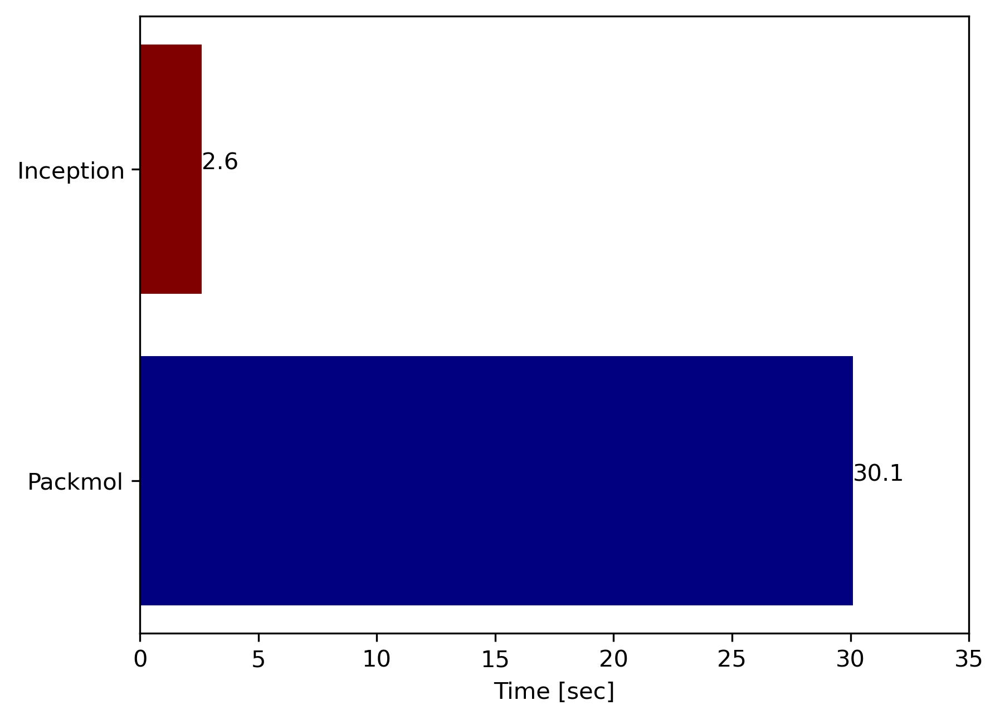

# Inception : A moleuclar packing tool, faster and periodic

A molecular packing tool similar to widely popular packmol. But, it is aimed to be faster, and obey periodic boundary conditions. 

## Table of contents 
- [Installation](#installation)
- [How to use](#how-to-use)
- [Performance benchmark](#performance-benchmark)
- [Upcoming features](#upcoming-features)
- [Credits](#credits)

## Installation 
#### Requirement: 
+ A modern C++ compiler (C++-17) and 
+ cmake

Built is tested with GCC-11 and Clang-14. 

```bash 
git clone https://github.com/masrul/Inception.git
cd Inception 
mkdir build && cd build 
cmake .. -DCMAKE_INSTALL_PREFIX=/path/to/installation
make && make install 
```

## How to use 
**toml** file is used to interact with the tool. 

A simple example toml file to pack 5000 water molecules into 100 angstrom cubic box. Fig-1 shows the packing. 
 
```toml 
[config]
    tolerance = 3.0
    out_file = "out.gro"

[box]
    xlim = [0.0,100.0]
    ylim = [0.0,100.0]
    zlim = [0.0,100.0]

[[packing]]
    file="water.pdb"
    nitems = 5000
```

<p align="center">
  
  <br>
  Fig-1: Packing 5000 water molecules using Inception.
</p>

**toml** file mainly has three sections, 

+ **[config]**
	+ tolerance = minimium distance between atoms 
	+ out_file = coordinate file to write output, currently gro, pdb and xyz is supported 
	+ max_trails = Maximum number of trails to insert a molecules, default is 1000 
	+ rand_seed = Seed for random number, default is based on OS time. 

+ **[box]** 
	+ **xlim** = Limit of box edge along $X$ direction 
	+ **ylim** = Limit of box edge along $Y$ direction 
	+ **zlim** = Limit of box edge along $Z$ direction 

There are two types of packing supported currently, 
### Type-1: Random insertion 
+ **[[packing]]**  
	+ **file** = Coordinate file of molecule [gro, pdb, xyz, and mol]. 
	+ **nitems** = Number of molecules. 
	+ xlim = Limit molecule center along $X$ direction. 
	+ ylim = Limit molecule center along $Y$ direction.
	+ zlim = Limit molecule center along $Z$ direction. 

Using the packing limit, we can restrict molecular packing to certain region. For example, we can create interface of water and decane. 

```toml 
[config]
    tolerance = 3.0
    out_file = "out.gro"

[box]
    xlim = [0.0,150.0]
    ylim = [0.0,150.0]
    zlim = [0.0,200.0]

[[packing]]
    file="water.pdb"
    nitems = 10000
    zlim = [0.0,100.0]

[[packing]]
    file="decane.gro"
    nitems = 2000
    zlim = [100.0,200.0]
```

<p align="center">
  
  <br>
  Fig-2: Creating interface between water and decane. 
</p>

### Type-2: Pinned insertion 
 
**[[packing]]**

+ **file** = Coordinate file of molecule [gro, pdb, xyz, and mol].
+ **location** = Where to pin the center-of-mass. 

User can pin the center-of-mass of molecule into the certain location. 
Here is an example of pinning a macromolecule into the center of a box.

```toml 
[config]
    tolerance = 3.0
    out_file = "out.gro"

[box]
    xlim = [0.0,100.0]
    ylim = [0.0,100.0]
    zlim = [0.0,100.0]

[[packing]]
    file = "lignin.gro"
    location = [50.0,50.0,50.0]

[[packing]]
    file="water.pdb"
    nitems = 8000
```

<p align="center">
  
  <br>
  Fig-3: Pinning Lignin into a box full of water.  

</p>

**Notes:** 

+ **Bold** options are required. 
+ [[packing]] section has double square brakets. 
+ [toml11](https://github.com/ToruNiina/toml11) expects floating point number has decimal point. 
+ If **location** keyword presents in [[packing]], pinned insertion is assumed. 

## Performance benchmark 
**Inception** is typically extremely fast for larger molecule. But for small molecules (natoms <= 3), packmol is faster. Benchmark is carried out in macbook pro M2 and both software is compiled with gcc-11, and **-O** optimization flag. Plots are showing time required to complete packing (smaller is better). 
 

**Case-1:** Packing interface as shown in Fig-2. Inception is order of magnitude faster than packmol. 

<details>
<summary>Inception input file</summary>

```toml 
[config]
    tolerance = 3.0
    out_file = "out.gro"

[box]
    xlim = [0.0,150.0]
    ylim = [0.0,150.0]
    zlim = [0.0,200.0]

[[packing]]
    file="water.pdb"
    nitems = 10000
    zlim = [0.0,100.0]

[[packing]]
    file="decane.gro"
    nitems = 2000
    zlim = [100.0,200.0]
```
</details>

<details>
<summary>Packmol input file</summary>

```
tolerance 3.0
filetype pdb
output out_packmol.pdb

structure ./water.pdb
  number 5000
  inside box 0. 0. 0. 150. 150. 100.
end structure

structure ./decane.pdb
  number 2000
  inside box 0. 0. 100. 150. 150. 200.
end structure
```

</details>

<p align="center">
  
  <br>
</p>

**Case-2:**  Packing 20000 water into 200 angstrom cubic box. For smaller molecule, packmol is still a faster option. 

<details>
<summary>Inception input file</summary>

```toml 
[config]
    tolerance = 3.0
    out_file = "out.gro"

[box]
    xlim = [0.0,200.0]
    ylim = [0.0,200.0]
    zlim = [0.0,200.0]

[[packing]]
    file="water.pdb"
    nitems = 20000
```
</details>

<details>
<summary>Packmol input file</summary>

```
tolerance 3.0
filetype pdb
output out_packmol.pdb

structure ./water.pdb
  number 20000
  inside box 0. 0. 0. 200. 200. 200.
end structure
```

</details>

<p align="center">
  
  <br>
</p>

**Case-3:**  Packing a very large molecule, which has 65 atoms per molecule. Here, Inception is blazing fast :fire: !

<details>
<summary>Inception input file</summary>

```toml 
[config]
    tolerance = 3.0
    out_file = "out.gro"

[box]
    xlim = [0.0,300.0]
    ylim = [0.0,300.0]
    zlim = [0.0,300.0]

[[packing]]
    file="fmoc.pdb"
    nitems = 5000
```
</details>

<details>
<summary>Packmol input file</summary>

```
tolerance 3.0
filetype pdb
output out_packmol.pdb

structure ./fmoc.pdb
  number 5000
  inside box 0. 0. 0. 300. 300. 300.
end structure

```

</details>

<p align="center">
  
  <br>
</p>

## Upcoming features
+ Supporting triclinic box.
+ Python bindings for easy workflow using pybind11. 
+ Solvating protein in dodecahedron box with pre-equilibrated solvent. 
+ Building membrane.  


## Credits
Following third party libraries are used for parsing and progressbar. 
 
+ [toml11](https://github.com/ToruNiina/toml11) for parsing user input. 
+ [progressbar](https://github.com/gipert/progressbar) for showing progressbar. 

